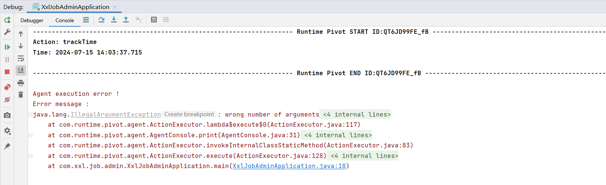
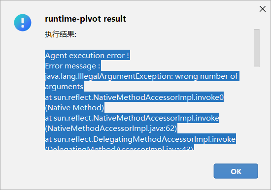
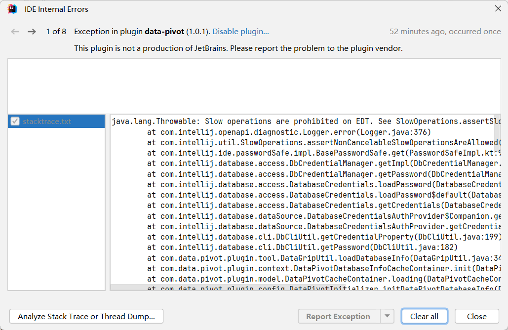

Before submitting your issue, please answer some questions. Thank you!
在提交问题之前，请回答一些问题。谢谢！

### Which version of runtime-pivot are you using? 您使用哪个版本的runtime-pivot?

### Which version of JDK are you using? 您使用哪个版本的JDK?

### Which version of IntelliJ IDEA IC are you using? 您使用哪个版本的 IntelliJ IDEA IC ?

### Expected Result 预期结果

### Actual Result 实际结果

### Steps to Reproduce 重现步骤

### Additional Information 其他信息

### Error Message 报错信息

> View examples 查看示例:
> - Console 控制台:
> 
> 
> 
> - Dialog 对话框:
> 
> 

Please paste the content into ```error msg```.请将内容粘贴到```error msg```.

```error msg


```

### IDEA Error Report IDEA错误报告

> View examples 查看示例:
> 
> 

Please paste the content into ```error msg```.请将内容粘贴到```error msg```.

```error msg


```