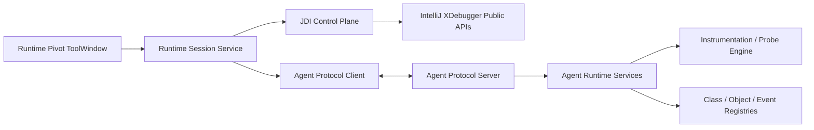

# Runtime Pivot 3.0 改造与重构设计

> 文档状态：实施规格  
> 目标版本：Runtime Pivot 3.0.0  
> IDE 基线：IntelliJ IDEA 2025.3，Build 253 及以上  
> 文档日期：2026-06-06  
> 适用对象：后续负责完整实现、迁移、测试和验收的开发者或 AI 编码代理

## 1. 文档目的

Runtime Pivot 2.x 已经验证了一个有价值的方向：在 IDEA 调试会话中结合
Java Debug Interface（JDI）和 Java Agent，提供类、对象、调用栈和运行时信息分析能力。

但当前实现把大多数能力都绑定在“程序先命中断点并暂停”这个前提上：

```text
IDEA Action
  -> 当前 XStackFrame Evaluator
  -> 拼接 Java Code Fragment
  -> 反射调用 Agent ActionExecutor
  -> Agent 在命中断点的线程中执行
  -> 结果打印到目标进程标准输出
  -> IDEA 弹窗显示简短结果
```

这种方式适合读取当前栈帧局部变量，却不适合全局 JVM 查询、持续监控、流式事件和
耗时较长的操作。3.0 的目标不是简单替换 UI，而是重新划分调试器与 Agent 的职责，
形成稳定、可测试、可扩展的双通道架构。

本文档是 3.0 的实施依据。后续实现不得绕过本文档中的公开 API、安全、测试和验收门禁。

## 2. 当前问题清单

以下问题是 3.0 必须解决的已知基线，不得只通过改名或移动代码规避。

### 2.1 架构问题

- 所有 Agent 功能依赖当前调试会话和暂停栈帧。
- 全局 JVM 查询也通过当前事件线程执行。
- 控制指令、业务结果和 UI 展示都耦合在 Java Code Fragment 中。
- Agent 主要把结果打印到目标进程 `System.out`，IDEA 无法可靠解析和交互。
- 普通断点 Suspend ALL 时，Agent 后台通信线程也可能被挂起。

### 2.2 调试器集成问题

- 大量使用 `com.intellij.xdebugger.impl` 内部类。
- 生产代码复制了 JetBrains `@TestOnly` 工具。
- 栈帧收集存在 EDT 阻塞和手动 pump 事件队列行为。
- 对象操作直接读取 debugger tree 的内部 UI 节点。
- Action `update()` 和 `actionPerformed()` 之间存在会话恢复竞态。
- 多处未处理空栈帧、空 SourcePosition、会话停止等状态。

### 2.3 Agent 问题

- `ClassLoadingTransformer` 无上限保存类加载历史。
- 类加载记录强引用 `ClassLoader`，可能阻止类卸载。
- `ActionExecutor.execute()` 全局同步，长任务串行执行。
- JSON、类扫描、retransform 和文件 IO 可能运行在断点命中线程。
- 通过 `sun.instrument` 私有字段枚举 Transformer。
- Agent fat jar 体积和依赖过大，存在 classpath 污染风险。
- Agent jar 文件名、内部 banner、插件版本不一致。
- 只有 `Premain-Class`，设置却使用了容易误解的 Attach 命名。

### 2.4 功能正确性问题

- 当前 Monitoring 测量的是 IDEA resume 到 pause 的墙钟时间，不是代码真实耗时。
- Tracepoint 的 `SuspendPolicy.NONE` 仍可能短暂挂起事件线程。
- Class Dump 使用模糊类名匹配，可能 Dump 错误的同名或相似类。
- Object Load 对 Collection/Map 可能先 clear，失败后破坏原对象。
- 文件选择取消后可能访问空 `VirtualFile`。
- 字符串和路径通过 Java 源码拼接，转义不完整。
- 对象变量的 UI 显示名称不一定是可求值 Java 表达式。

### 2.5 工程质量问题

- 当前 `gradlew test` 为 `NO-SOURCE`。
- 原配置声明支持 Build 221，但插件字节码目标为 Java 17，兼容声明错误。
- 缺少协议测试、Agent 多 JDK 测试和 IDE UI 测试。
- Agent 源码子模块未初始化，主工程只依赖预构建 jar。
- 错误处理以弹窗和 `printStackTrace()` 为主，缺少结构化错误模型。

## 3. 3.0 总体目标

3.0 必须完成以下目标：

1. 仅支持 IntelliJ IDEA 2025.3（Build 253）及以上版本。
2. IDEA 插件使用 Java 21 和 IntelliJ Platform Gradle Plugin 2.x。
3. 删除插件对 IntelliJ `impl`、`@ApiStatus.Internal`、`@TestOnly` API 的依赖。
4. 禁止通过反射访问 `com.intellij.*` 类、字段或方法。
5. 删除对 JDK 私有实现（例如 `sun.instrument.*`）的反射访问。
6. 建立 IDEA 插件与 Agent 之间的双向、结构化、可鉴权通信。
7. 将全局查询和持续监控迁移到 Agent 数据通道。
8. 保留 JDI 对当前栈帧、局部变量、断点和 Drop Frame 的控制能力。
9. 将主要交互迁移到 Runtime Pivot ToolWindow，减少模态弹窗。
10. 将 Monitoring 重做为目标 JVM 内计时的 Probe 系统。
11. 将 Agent 返回值从控制台文本改为结构化结果。
12. 补齐单元测试、集成测试、IDE UI 测试和多 JDK Agent 测试。

## 4. 非目标

3.0 不应承担以下目标：

- 不将 Runtime Pivot 定位成生产环境 APM 或在线诊断平台。
- 不实现任意远程主机访问，Agent 通信只允许本机回环地址。
- 不通过不稳定的 IDEA 内部 API 强行保留旧交互。
- 不提供默认开启的任意 Java 代码远程执行服务。
- 不把高频方法追踪建立在 JDI MethodEntry/MethodExit 事件上。
- 不在 3.0 中兼容 2025.2 及更早版本。

## 5. 平台和构建基线

### 5.1 IDEA 插件基线

建议的 Gradle 属性：

```properties
pluginVersion=3.0.0
platformType=IC
platformVersion=2025.3
pluginSinceBuild=253
```

要求：

- `since-build` 必须为 `253`。
- 不再声明 221、223、242 等旧平台兼容范围。
- 删除 `pluginUntilBuild` 属性，并且构建脚本不设置 `untilBuild`。
- CI 必须验证 2025.3、最新稳定版和最新 EAP。
- IntelliJ Platform Gradle Plugin 使用执行改造时官方可用的最新 2.x 版本。
- Gradle Wrapper 升级到该插件版本要求的 Gradle 9.x。
- Kotlin 升级到适用于 2025.3 平台插件开发的 Kotlin 2.x。
- 插件 Java/Kotlin 字节码目标统一为 Java 21。

示例：

```kotlin
kotlin {
    jvmToolchain(21)
}

tasks.withType<JavaCompile>().configureEach {
    sourceCompatibility = "21"
    targetCompatibility = "21"
}

intellijPlatform {
    pluginConfiguration {
        version = providers.gradleProperty("pluginVersion")
        ideaVersion {
            sinceBuild = "253"
        }
    }
}
```

### 5.2 Agent 运行基线

IDEA 插件使用 Java 21，不代表被调试应用必须使用 Java 21。

Agent 应继续独立编译，建议支持：

| 组件 | 编译目标 |
| --- | --- |
| IDEA Plugin | Java 21 |
| Protocol API | Java 8 |
| Agent Bootstrap | Java 8 |
| Agent Core | Java 8，必要功能按目标 JDK 做能力降级 |

目标 JVM 测试矩阵：

- Java 8
- Java 11
- Java 17
- Java 21

如果某项功能无法在旧 JDK 上实现，必须通过 Agent capability 返回“不支持”，不能启动失败。

## 6. IDEA API 使用门禁

### 6.1 硬性禁止

插件代码禁止：

- 导入 `com.intellij.*.impl.*`。
- 导入位于 `*-impl.jar` 中、没有公开承诺的类。
- 使用 `@ApiStatus.Internal` 或 `@IntellijInternalApi` API。
- 使用 `@TestOnly` API或复制 JetBrains 测试工具到生产代码。
- 通过 `Class.forName`、`getDeclaredField`、`getDeclaredMethod`、
  `setAccessible` 等方式访问 IDEA API。
- 使用字符串形式反射访问 `com.intellij.*`。
- 为规避编译错误复制 IDEA 内部实现代码。

同时禁止 Agent 反射访问：

- `sun.instrument.*`
- `jdk.internal.*`
- 其他依赖具体 JDK 实现字段布局的类

### 6.2 受限 API

以下 API 默认禁止，确需使用时必须单独记录 ADR：

- `@ApiStatus.Experimental`
- `@ApiStatus.ScheduledForRemoval`
- `@Deprecated`
- `@ApiStatus.Obsolete`

当前唯一可暂时批准的例外是 `XDropFrameHandler`。它是 IDEA 提供的正式调试接口，
但标记为 Experimental。必须将其封装在独立的 `DropFrameCapability` 中，禁止扩散到业务代码。

### 6.3 自动检查

CI 必须增加以下检查：

1. IntelliJ Plugin Verifier。
2. 禁止 API 静态扫描。
3. 导入包扫描。
4. 反射目标扫描。

建议失败条件：

```text
COMPATIBILITY_PROBLEMS
DEPRECATED_API_USAGES
SCHEDULED_FOR_REMOVAL_API_USAGES
INTERNAL_API_USAGES
OVERRIDE_ONLY_API_USAGES
NON_EXTENDABLE_API_USAGES
MISSING_DEPENDENCIES
INVALID_PLUGIN
```

`XDropFrameHandler` 的 Experimental 报告只能精确白名单该符号，不允许全局忽略 Experimental。

建议增加源码扫描规则：

```text
禁止 import com.intellij..impl.
禁止字符串 "com.intellij." 出现在反射调用附近
禁止 @TestOnly 依赖
禁止 sun.instrument
禁止 jdk.internal
```

## 7. 目标架构

3.0 使用“JDI 控制面 + Agent 数据面 + ToolWindow 展示面”：



### 7.1 JDI 控制面职责

JDI 负责：

- 获取当前调试会话和暂停状态。
- 获取当前栈帧。
- 在当前栈帧执行表达式或代码片段。
- 访问局部变量、参数和 `this`。
- 创建和管理普通行断点/Tracepoint。
- Drop Frame。
- 断点命中时执行一次性 Agent Bridge 调用。
- 在全线程暂停时完成必须依赖事件线程的操作。

### 7.2 Agent 数据面职责

Agent 负责：

- ClassLoader 与已加载类查询。
- 类加载事件缓冲和流式推送。
- 类字节码 Dump。
- Runtime Pivot 自己注册的 Transformer/Probe 查询。
- 对象布局、序列化、预览和受控修改。
- 方法/行 Probe 安装、移除、计时、计数和事件采集。
- 长耗时任务异步执行。
- 结构化结果和错误返回。

### 7.3 展示面职责

ToolWindow 负责：

- 会话选择和连接状态。
- 命令进度、取消和历史。
- 结构化树、表格和详情展示。
- Console 日志。
- Probe 配置与实时统计。
- 危险操作确认。
- 导出结果。

## 8. 推荐模块划分

建议将仓库重构为 Gradle 多模块：

```text
runtime-pivot
├── plugin
│   ├── plugin-core
│   ├── plugin-debugger
│   └── plugin-ui
├── agent
│   ├── agent-bootstrap
│   ├── agent-core
│   └── agent-probe
├── protocol
├── integration-tests
└── test-apps
```

职责：

| 模块 | 职责 |
| --- | --- |
| `protocol` | DTO、消息类型、协议版本、编解码，不依赖 IDEA |
| `agent-bootstrap` | `premain/agentmain`、连接初始化、最小依赖 |
| `agent-core` | JVM 查询、类、对象、任务执行 |
| `agent-probe` | 字节码变换、Probe 生命周期、事件缓冲 |
| `plugin-core` | 项目服务、连接、命令、状态仓库 |
| `plugin-debugger` | XDebugger 公开 API 适配、Evaluator、断点 |
| `plugin-ui` | ToolWindow、Console、表格、树、操作面板 |
| `integration-tests` | 插件与 Agent 端到端测试 |
| `test-apps` | Java 8/11/17/21/25 测试程序 |

Agent 源码必须成为当前构建的一部分，不能继续只提交一个不可追踪源码的 fat jar。

## 9. Agent 注入和连接

### 9.1 启动注入

继续使用公开的 `JavaProgramPatcher` 修改 Java 启动参数：

```text
-javaagent:/path/runtime-pivot-agent.jar=<encoded-config>
```

设置名称从 `Attach Agent` 改为：

```text
Inject Runtime Pivot Agent on launch
```

因为当前行为是 premain 启动注入，不是动态 attach。

### 9.2 动态 Attach

如果 3.0 实现动态 Attach：

- Agent Manifest 增加 `Agent-Class`。
- 实现 `agentmain`。
- 作为独立可选能力。
- 不得伪装成所有运行配置都支持。
- 无 `jdk.attach` 或权限不足时返回明确 capability/error。

动态 Attach 不是替代启动注入的必要条件。

### 9.3 连接模型

建议 IDEA 端监听，Agent 主动连接：

1. IDEA 在 `127.0.0.1` 分配随机端口。
2. IDEA 生成至少 128 bit 随机 token。
3. 端口、token、project/session id 通过 Agent 参数传入。
4. Agent 启动后主动连接 IDEA。
5. 双方交换协议版本和 capabilities。

禁止：

- 监听 `0.0.0.0`。
- 固定端口。
- 无 token 连接。
- 将 token 输出到普通日志。
- 默认允许其他进程执行任意代码。

### 9.4 Suspend ALL 限制

普通断点使用 Suspend ALL 时，目标 JVM 的 Agent 通信线程也可能暂停。

因此：

- 不能假设命中断点后 socket 一定可响应。
- 当前帧和局部对象操作必须保留 JDI Evaluator 路径。
- 需要 Agent 后台线程参与的命令，在 Suspend ALL 时显示“恢复后执行”或改用一次性 JDI Bridge。
- Runtime Pivot 自己创建的 Tracepoint 默认使用 `SuspendPolicy.NONE`。

## 10. 通信协议

### 10.1 消息模型

协议至少包括：

```text
HandshakeRequest
HandshakeResponse
CommandRequest
CommandAccepted
CommandProgress
CommandResult
CommandError
EventBatch
CancelCommand
Heartbeat
ReleaseHandle
```

公共字段：

```json
{
  "protocolVersion": 1,
  "sessionId": "uuid",
  "requestId": "uuid",
  "type": "class.list",
  "timestampNanos": 0,
  "payload": {}
}
```

### 10.2 必须支持

- 长度分帧，禁止以换行作为唯一消息边界。
- requestId 关联。
- 超时。
- 取消。
- 最大消息体限制。
- 大字节码/文件分块。
- capability 协商。
- 协议版本不兼容的明确错误。
- Event Batch 和背压。
- 丢弃事件计数。

### 10.3 结果模型

Agent Provider 不再返回“已打印到控制台”字符串，而是返回 DTO：

```text
ClassLoaderTreeResult
LoadedClassesResult
ClassLoadingTimelineResult
ClassDumpResult
ObjectLayoutResult
ObjectSnapshotResult
ObjectMutationPreview
ProbeStatisticsResult
RuntimePivotTransformerResult
```

Console 只是结果的一种渲染方式，不是数据传输协议。

## 11. 特殊断点和 Probe 设计

### 11.1 Probe 模型

```text
RuntimePivotProbe
├── id
├── sourcePosition
├── locationSelector
├── kind
├── condition
├── captureExpressions
├── threadScope
├── instanceScope
├── sampleRate
├── hitLimit
├── lifecycle
└── status
```

Probe 类型：

- `SNAPSHOT`
- `LOG`
- `COUNTER`
- `TIMER_START`
- `TIMER_END`
- `METHOD_DURATION`
- `EVENT`
- `ONE_SHOT_CODE`

### 11.2 两种执行引擎

#### Debugger Tracepoint

使用场景：

- 需要当前局部变量。
- 一次性执行。
- 低频命中。
- 调试状态下的临时诊断。

实现：

- 使用普通 `XLineBreakpoint`。
- `SuspendPolicy.NONE`。
- 条件和日志表达式使用公开 `XBreakpoint` API。
- 表达式只调用极小的 Agent Bridge。
- 执行后自动恢复。

注意：IDEA Java 调试器仍会短暂挂起事件线程以求值，不能宣传为零暂停。

#### Agent Instrumentation Probe

使用场景：

- 高频计时。
- 方法耗时。
- Counter。
- 持续监控。
- 不需要读取任意当前栈帧变量。

实现：

- 使用成熟字节码库，例如 ASM。
- 计时使用目标 JVM 的 `System.nanoTime()`。
- 支持正常返回和异常退出。
- 支持 per-thread 嵌套调用。
- 事件写入有界缓冲区。
- 不在业务线程执行网络 IO。

### 11.3 Monitoring 定义

删除当前含义模糊的 `XSession Monitoring`。

替换为两个独立功能：

1. `Debug Pause Intervals`
   - 测量 IDEA resume 到下一次 pause 的墙钟时间。
   - 明确标注包含 JDWP、调度和断点处理开销。
   - 仅用于调试流程观察。

2. `Runtime Probes`
   - 在目标 JVM 中计时。
   - 用于方法/代码位置耗时、次数、分布。
   - 展示 count、min、max、avg、p50、p95、p99。

### 11.4 自定义代码安全

- 当前栈帧的一次性代码继续通过 XDebugger Evaluator 执行。
- 不开放无认证的 Agent 任意 Java 源码执行接口。
- 持续 Probe 使用受限配置/DSL，不保存任意 Java 代码。
- 有副作用的表达式必须显式确认。
- UI 明确区分只读操作和修改操作。

## 12. 功能重新分配

| 2.x 功能 | 3.0 执行方式 | 3.0 展示方式 | 说明 |
| --- | --- | --- | --- |
| ClassLoader Tree | Agent 通道 | Tree | 无需暂停 |
| ClassLoader Loaded Classes | Agent 通道 | Tree/Table | 支持过滤、分页 |
| Transformers | Agent 通道 | Table | 只展示 Runtime Pivot 自己管理的 Transformer |
| Class Loading Process | Agent 事件流 | Timeline/Table | 有界缓存，不保存 ClassLoader 强引用 |
| Class File Dump | Agent 命令 | Files/Result | 精确类和 ClassLoader 选择 |
| Object Internals | JDI 获取对象 + Agent/JDI Bridge | Detail | 依赖当前表达式 |
| Object Store | JDI 获取对象 + 结构化任务 | Files/Result | 支持预览、大小限制 |
| Object Load | JDI 获取对象 + 受控修改 | Diff/Confirm | 先解析验证，后原子修改 |
| Session Monitoring | Agent Probe | Probes Dashboard | 目标 JVM 内计时 |
| Pause Interval | IDEA Session Listener | Sessions | 与真实运行耗时分开 |
| Stack Breakpoint | JDI | Sessions/Frames | 异步计算栈帧 |
| Drop Frame | XDropFrameHandler | Frames | Experimental API 隔离 |
| Custom Code | JDI Evaluator | Console/Result | 只在暂停帧执行 |

## 13. 无法原样保留的功能

### 13.1 第三方 Transformer 枚举

标准 `Instrumentation` 没有获取所有已注册 Transformer 的公开 API。

3.0 必须删除对 `sun.instrument.TransformerManager` 的反射。新功能改为：

- 展示 Runtime Pivot 自己注册的 Transformer。
- 展示 Probe 对应的目标类和状态。
- 展示 JVM 是否支持 retransform/redefine。

不得为了保留旧功能重新访问 JDK 私有字段。

### 13.2 调试变量树右键选中对象

2025.3 的公开 XDebugger API 没有稳定的“获取调试变量树当前选中 XValue 节点”接口。
旧实现依赖：

- `XDebuggerTreeActionBase`
- `XValueNodeImpl`
- `WatchesRootNode`

3.0 删除这些依赖，交互改为：

- ToolWindow 提供表达式输入框。
- 默认填充编辑器选中文本或光标处表达式。
- 通过当前 `XStackFrame.getEvaluator()` 求值。
- 可维护最近表达式列表。

在 JetBrains 提供公开选中值 API 前，不恢复直接读取 debugger tree 内部节点。

## 14. IDEA 公开 API 迁移表

| 当前使用 | 问题 | 3.0 替代 |
| --- | --- | --- |
| `DebuggerUIUtil.getSession(e)` | `impl` | `e.getData(XDebugSession.DATA_KEY)`，必要时使用 `XDebuggerManager.getCurrentSession()` |
| `XExpressionImpl.fromText` | `impl` | `XDebuggerUtil.createExpression(...)` |
| `XEvaluationCallbackBase` | `impl` | `XDebuggerEvaluator.XEvaluationCallback` |
| `XDebuggerTreeActionBase` | `impl` | 删除变量树节点依赖，改为表达式工作流 |
| `XValueNodeImpl` | `impl` | 不直接持有 UI 节点，使用 evaluator 结果 |
| `WatchesRootNode` | `impl` | 删除父节点类型判断 |
| `XBreakpointUtil.getShortText` | `impl` | 使用 `XLineBreakpoint` 文件、行号和自有 formatter |
| `XDebugSessionImpl` | `impl` | `XDebugSession` |
| `XDebuggerUtilImpl` | `impl` | `XDebuggerUtil` |
| `XStackFrameContainerEx` | `impl` | `XExecutionStack.XStackFrameContainer` |
| `ConsoleViewImpl` | `impl` | `ConsoleView` |
| `ServiceManager.getService` | 旧式 API | `project.getService(...)` |
| 手写 `JDialog` 作为主界面 | 生命周期分散 | `ToolWindowFactory` + project service |
| 反射调用 Agent `ActionExecutor` | 字符串脆弱、线程耦合 | Agent 协议；仅 JDI Bridge 使用稳定的公开静态入口 |

### 14.1 栈帧收集

删除复制的 `XDebuggerTestUtil`、`XTestContainer` 等测试辅助类。

使用公开异步 API：

```text
XSuspendContext.getActiveExecutionStack()
XExecutionStack.computeStackFrames(...)
XExecutionStack.XStackFrameContainer
```

要求：

- 不在 EDT 阻塞等待。
- 不调用 `blockingGet`。
- 不做事件队列 pump。
- 支持取消和会话过期。
- 回调更新 UI 时切换到 EDT。

### 14.2 普通 Tracepoint 创建

不导入 Java Debugger 实现类和 `JavaBreakpointHandlerFactory`。

使用公开 API：

```text
XDebuggerUtil.getLineBreakpointTypes()
XLineBreakpointType.canPutAt(...)
XLineBreakpointType.createBreakpointProperties(...)
XBreakpointManager.addLineBreakpoint(...)
XBreakpoint.setSuspendPolicy(...)
XBreakpoint.setConditionExpression(...)
XBreakpoint.setLogExpressionObject(...)
```

Runtime Pivot 元数据由自己的 project service 保存，不修改 IDEA 私有 breakpoint properties。

## 15. ToolWindow 设计

注册一个 `Runtime Pivot` ToolWindow，默认位于底部。

建议标签：

### 15.1 Console

- 使用 `TextConsoleBuilderFactory` 创建 `ConsoleView`。
- 展示命令、Agent 日志、错误和可导航链接。
- 支持清空、暂停输出、复制和过滤。

### 15.2 Probes

- Probe 列表。
- 启用/禁用。
- 命中次数和状态。
- 实时统计。
- 安装失败原因。
- 导出 CSV/JSON。

### 15.3 Classes

- ClassLoader Tree。
- 已加载类列表。
- 类加载 Timeline。
- Dump 操作和文件导航。

### 15.4 Objects

- 表达式输入。
- Evaluate。
- Object Layout。
- Snapshot/Store。
- Load Preview。
- 修改确认和结果。

### 15.5 Sessions

- 当前调试会话。
- Agent 连接和 capabilities。
- Pause Intervals。
- 调用栈和可 Drop Frame 状态。

### 15.6 UI 规则

- 长任务必须显示进度和取消按钮。
- 不用成功弹窗展示普通结果。
- 模态对话框只用于危险修改确认。
- 所有 Swing 更新在 EDT。
- Agent/JDI/IO 操作不在 EDT。
- 会话停止后内容保留为只读历史，连接资源立即释放。

## 16. Agent 内部重构

### 16.1 ActionExecutor

删除当前全局 `synchronized execute(String, Object...)` 中心。

替换为：

```text
CommandRouter
CommandHandler<TRequest, TResponse>
TaskExecutor
EventPublisher
CapabilityRegistry
```

要求：

- 每个命令有类型安全 DTO。
- 长任务进入专用线程池。
- 支持取消和超时。
- 不在业务线程做文件 IO 和网络 IO。
- 错误返回错误码、消息和受控堆栈。

### 16.2 ClassLoadingTransformer

当前实现保存所有历史并强引用 ClassLoader，3.0 必须改为：

- 有界环形缓冲。
- 默认容量可配置，例如 10,000。
- 仅保存 className、loaderId、timestamp、eventKind。
- Loader Registry 使用弱引用。
- 不保存 `Class<?>` 或 `ClassLoader` 强引用到无限期集合。
- 支持过滤包名前缀。
- 记录 droppedEvents。

### 16.3 Class Dump

要求：

- 类名默认精确匹配，禁止 `contains` 匹配。
- 多 ClassLoader 同名类必须让用户选择。
- 检查 `Instrumentation.isModifiableClass`。
- 临时 Transformer 必须 finally 移除。
- 返回字节数组摘要、SHA-256、目标路径和错误列表。
- 文件写入 IDEA 项目目录时需路径校验。

### 16.4 Object Store/Load

Store：

- 支持最大深度、最大对象数、最大文件大小。
- 支持循环引用检测。
- 不默认序列化敏感字段。
- 返回结构化文件信息。

Load：

1. 读取并解析到临时对象。
2. 验证目标类型。
3. 生成变更预览。
4. 用户确认。
5. 执行修改。
6. 失败时不能先清空原 Collection/Map。

Object Handle：

- 默认弱引用。
- handle 带 sessionId、TTL 和类型摘要。
- 显式 pin 才允许短期强引用。
- 会话结束必须全部释放。

### 16.5 Agent 依赖

- 不再打入未使用的大量依赖。
- Agent 内部依赖必须 relocate/shade，避免污染应用 classpath。
- Agent bootstrap 保持最小体积。
- 协议和 bootstrap 不依赖 Hutool。
- 统一版本号，Manifest、banner、插件和协议都可追踪。

## 17. 线程与并发模型

### 17.1 IDEA 侧

- EDT：只处理 UI。
- Background Task：文件、序列化、协议等待。
- Debugger Callback：快速捕获状态后转交 service。
- 所有回调必须验证 project、session、request 是否仍有效。

### 17.2 Agent 侧

- 业务线程中的 Probe 只写轻量事件。
- Agent Worker 处理聚合。
- Agent IO Thread 处理协议。
- Command Executor 处理查询和文件任务。
- 所有队列必须有界。

### 17.3 死锁规避

- JDI 方法调用不得默认使用会锁住其他必要线程的 Suspend ALL 策略。
- 在目标线程执行用户代码前提示副作用。
- Agent 命令不得等待当前已被挂起的业务线程完成。
- 禁止 Agent command handler 获取全局锁后执行网络写入。

## 18. 安全要求

- 通信仅绑定 loopback。
- 每次运行生成随机 token。
- 每条连接校验 sessionId。
- Object Load、字段修改、自定义代码属于危险操作。
- 危险操作必须显示目标 JVM、线程、表达式和影响范围。
- 文件路径必须 canonicalize，阻止目录穿越。
- Agent 错误不返回任意敏感对象内容。
- 日志默认脱敏 token、绝对用户目录和对象内容。
- 不允许通过协议调用任意类名/方法名反射执行。

## 19. 配置设计

Project Settings：

- Inject Agent on launch
- Enable Agent communication
- Event buffer size
- Probe sample rate default
- Object snapshot limits
- Output directory
- Keep session history

Run Configuration Override：

- Use project default
- Enable
- Disable

配置变更如果需要重启目标 JVM，UI 必须明确提示“下次启动生效”。

## 20. 实施阶段

### Phase 0：建立基线

任务：

- 更新版本到 3.0.0。
- 平台升级到 2025.3 / Build 253。
- Java 21、Kotlin 2.x、Gradle 9.x。
- 初始化 Agent 子模块源码。
- 建立多模块结构。

验收：

- 2025.3 能启动插件沙箱。
- Plugin Verifier 对 2025.3 无 compatibility problem。
- 不再声明旧 IDEA 版本兼容。

### Phase 1：公开 API 清理

任务：

- 删除所有 `com.intellij.*.impl` import。
- 删除复制的测试工具。
- 替换 session、evaluator、expression、callback、console API。
- 栈帧改为异步计算。
- 对象操作改为表达式工作流。

验收：

- INTERNAL_API_USAGES 为 0。
- 反射 IDEA API 为 0。
- EDT 阻塞等待为 0。

### Phase 2：ToolWindow 和状态模型

任务：

- 实现 ToolWindow。
- 建立 project service 和 session model。
- 实现 Console、Classes、Objects、Sessions 基础页。
- 替换成功弹窗。

验收：

- 所有旧菜单操作有明确的新入口。
- 会话启动、切换、停止生命周期正确。
- UI 自动化测试覆盖主要状态。

### Phase 3：协议和 Agent 连接

任务：

- 实现 protocol 模块。
- loopback、随机端口、token、handshake。
- command/result/progress/cancel。
- capability 协商。

验收：

- Agent 连接断开可恢复。
- 错误 token 被拒绝。
- 超时和取消生效。
- 大消息分块正常。

### Phase 4：全局 JVM 功能迁移

任务：

- ClassLoader Tree。
- Loaded Classes。
- Class Loading Timeline。
- Class Dump。
- Runtime Pivot Transformer 列表。

验收：

- 运行中无需断点即可使用。
- 类加载事件内存有上限。
- 不访问 `sun.instrument`。

### Phase 5：对象功能迁移

任务：

- 表达式求值。
- Object Handle。
- Object Layout。
- Store。
- Load Preview 和受控修改。

验收：

- 取消文件选择无异常。
- 字符串不再通过手写 Java 代码拼接。
- Load 失败不破坏原 Collection/Map。
- 会话结束 handle 全部释放。

### Phase 6：Probe 和 Monitoring

任务：

- Probe 模型和持久化。
- Agent 字节码插桩。
- Timer、Counter、Method Duration。
- 实时聚合和 Dashboard。
- Debugger Tracepoint Bridge。

验收：

- 时间戳来自目标 JVM `System.nanoTime()`。
- 正常返回和异常退出都有数据。
- 高频事件有采样和背压。
- 禁用 Probe 后类可正确恢复或停止采集。

### Phase 7：Stack 与 Drop Frame

任务：

- 异步调用栈分析。
- 自有断点显示 formatter。
- Drop Frame capability 隔离。
- 删除 `XBreakpointUtil` 等内部 API。

验收：

- 不在 EDT 阻塞。
- 不支持 Drop Frame 时按钮正确禁用。
- API 例外仅存在于单个适配类。

### Phase 8：删除遗留实现

任务：

- 删除 `ActionExecutorUtil` 代码字符串模板。
- 删除旧 JDialog。
- 删除旧回调弹窗。
- 删除不可追踪 agent jar 依赖。
- 删除旧配置名称。
- 更新 README、CHANGELOG 和迁移说明。

验收：

- 旧实现类不再参与编译。
- fat jar 由当前源码构建生成。
- 版本号一致。

## 21. 测试计划

### 21.1 单元测试

- 协议编解码。
- capability 协商。
- Probe 配置校验。
- 有界缓冲与 dropped count。
- Object Load 预览和失败回滚。
- 路径校验。
- 统计聚合。

### 21.2 插件平台测试

- Action availability。
- Session 生命周期。
- 普通 Tracepoint 创建/删除。
- 表达式执行成功和失败。
- 栈帧异步加载。
- ToolWindow 状态。

### 21.3 Agent 集成测试

每个目标 JDK 测试：

- premain。
- 可选 agentmain。
- handshake。
- 类列表。
- 类加载事件。
- class dump。
- object snapshot。
- probe timer/counter。
- shutdown cleanup。

### 21.4 性能测试

- Agent 空闲时 CPU 接近 0。
- 未启用 Probe 时业务路径无额外字节码逻辑。
- Probe 命中吞吐和采样。
- 类加载缓冲长期稳定。
- 10 万次事件后内存不线性增长。

### 21.5 UI 测试

- 连接中、已连接、断开、Agent 不存在。
- 无调试会话。
- 会话运行中。
- Suspend THREAD。
- Suspend ALL。
- 长任务取消。
- 大结果分页。

## 22. CI 门禁

每次提交至少执行：

```text
compile
unit tests
integration tests
buildPlugin
verifyPlugin
forbidden API scan
agent JDK matrix
```

发布前：

- 2025.3 最低版本验证。
- 最新稳定 IDEA 验证。
- 最新 EAP 验证。
- Plugin Verifier 报告归档。
- Agent 依赖和许可证清单。
- 安全扫描。

## 23. 3.0 完成定义

只有满足以下条件才能标记 3.0 完成：

- IntelliJ IDEA 最低支持版本为 2025.3 / Build 253。
- 插件源码不存在 `com.intellij.*.impl` import。
- 不反射访问 IDEA 或 JDK 私有 API。
- Plugin Verifier 无 Internal API 和 compatibility problem。
- 所有核心结果通过结构化 DTO 返回。
- 全局 JVM 功能无需命中断点。
- 局部变量功能仍可在当前暂停栈帧使用。
- Monitoring 使用目标 JVM 计时。
- ToolWindow 覆盖核心工作流。
- Agent 通信有 loopback、token、版本和能力协商。
- 类加载事件和对象 handle 不产生无限强引用。
- Object Load 失败不破坏原对象。
- 测试不再是 `NO-SOURCE`。
- README 和迁移文档与真实行为一致。

## 24. 后续 AI 执行要求

后续 AI 接到“完成 Runtime Pivot 3.0 改造”任务时，应遵循：

1. 先读取本文档和当前仓库，不得直接在旧架构上继续堆功能。
2. 按 Phase 0 到 Phase 8 顺序实施，每阶段完成后运行对应验收。
3. 遇到公开 API 不足时，调整交互或功能边界，不使用内部 API 规避。
4. 不保留旧代码字符串拼接作为长期兼容路径。
5. 每个阶段补测试，不把测试统一留到最后。
6. 不修改无关文件，不覆盖用户已有修改。
7. 不直接推送 GitHub。
8. 最终必须提交实现结果、测试结果、Plugin Verifier 结果和剩余限制。

## 25. 已确认的产品决策

以下事项不再留给实现阶段重新选择：

- 3.0 最低 IDEA 版本为 2025.3。
- 插件运行时使用 Java 21。
- 架构采用 JDI 控制面和 Agent 数据面并存。
- 主 UI 使用 Runtime Pivot ToolWindow。
- 高频 Monitoring 使用 Agent Probe。
- 当前栈帧自定义代码使用 JDI Evaluator。
- 不枚举第三方 Transformer。
- 不读取 IDEA 调试变量树内部节点。
- 不通过反射访问 IDEA/JDK 私有 API。
- 不把 `SuspendPolicy.NONE` 描述成完全无暂停。
- Agent 通信只允许本机鉴权连接。

## 26. 参考资料

- [IntelliJ Platform SDK](https://plugins.jetbrains.com/docs/intellij/welcome.html)
- [IntelliJ Platform Gradle Plugin](https://plugins.jetbrains.com/docs/intellij/tools-intellij-platform-gradle-plugin.html)
- [Plugin Compatibility](https://plugins.jetbrains.com/docs/intellij/verifying-plugin-compatibility.html)
- [Internal API Migration](https://plugins.jetbrains.com/docs/intellij/api-internal.html)
- [Tool Windows](https://plugins.jetbrains.com/docs/intellij/tool-windows.html)
- [IntelliJ Community 源码](https://github.com/JetBrains/intellij-community)

实施时应以 IntelliJ IDEA 2025.3 对应的 253 分支/源码为准，不直接依据较新 master 中尚未进入
2025.3 的 API。

